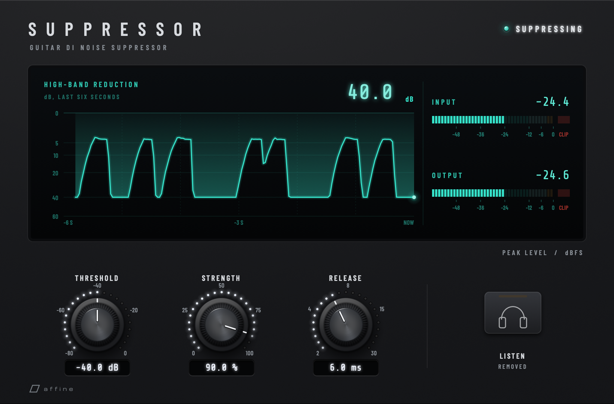
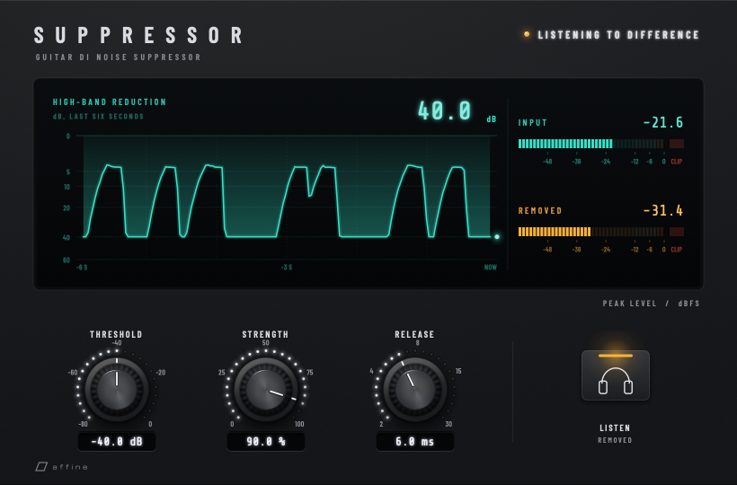
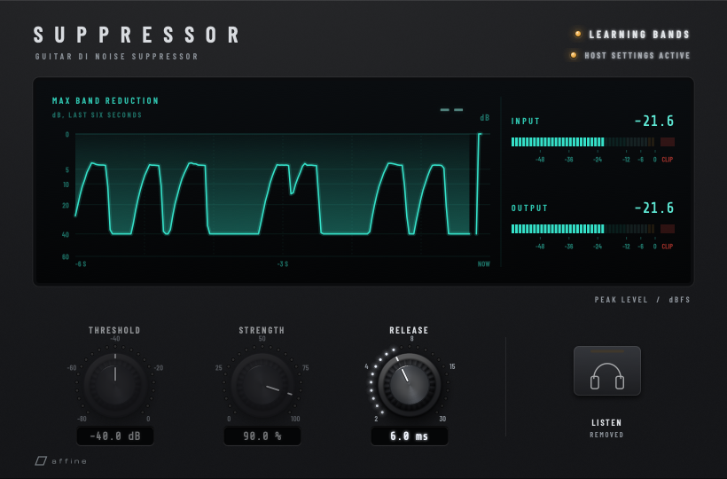
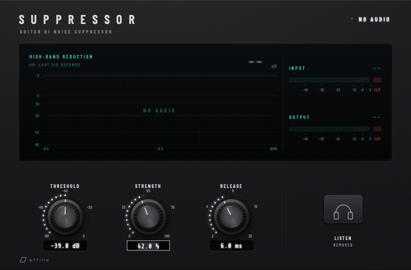

# Suppressor interface

The editor implements the shared [Affine design language](../libs/affine-ui/DESIGN_LANGUAGE.md)
(v2.0) in its **Stealth** finish through the vendored `affine_ui` JUCE module. This
document records only the Suppressor-specific decisions.

  

## Product

- **Purpose:** zero-latency, frequency-split noise suppression for guitar DI before
  high-gain amplification.
- **Primary task:** remove high-band noise between notes without losing body, sustain or
  pick attack, and check what was removed when in doubt.
- **Finish:** modern matte hardware: black powder coat, dark knobs with white pointers
  and white LED rings, a rubber soft key, and one colour screen. Teal appears only on the
  screen and the *Suppressing* LED.
- **Editor:** fixed 820 × 540 logical pixels; renders natively at 100–200% and on Retina.

## Layout

| Zone | Contents |
|---|---|
| Header | Wide-tracked wordmark and descriptor; the processing status with its LED; *Host settings active* underneath when non-default legacy settings exist |
| Screen | Left: **high-band reduction** over the last six seconds, with the current value above the plot. Right: **INPUT** and **OUTPUT** peak bars (the output relabelled **REMOVED** while auditioning), each with a readout and a clip cell |
| Controls | Threshold, Strength, Release: medium knobs with LED rings and glass readouts; after a hairline, *Listen removed* as a soft key with a headphones glyph |

## Telemetry contract

All readings come from the processor's lock-free `MeterSnapshot`. A reading is live only
when a *new* audio block arrived within 500 ms and its routing flags match the current
Listen and band-mode settings, so an old block is never relabelled as the new mode.

| Display | Source | Presentation |
|---|---|---|
| Reduction plot | Deepest high-band gain reduction, 120 ms decay, sampled 30 times a second while the editor is open | 0–60 dB on a square-root scale, 0 dB at the top, newest at the right; the plot breaks wherever reduction was unavailable (no audio, no input, learning) and reads *NO AUDIO* once six seconds hold no readings |
| Reduction readout | The latest reading | dB to 0.1, `60+` beyond the scale, `--` when unavailable |
| INPUT / OUTPUT bars | Peak across channels, 300 ms decay | −60 to 0 dBFS in 1.5 dB segments: teal, pale from −12 dBFS, amber from −3 dBFS |
| Clip cells | Processor clip flags, held for one second | Separate red cell at the end of each bar |
| Peak readouts | Same peaks | dBFS to 0.1 dB, `-inf` for silence, `--` when not live |
| Status | Snapshot flags | *No audio*, *No input*, *Passing signal*, *Suppressing*, *Listening to difference*, *Bypassed*, *Learning bands* |

The plot shows stored readings only: nothing is interpolated across gaps or extrapolated
past the newest reading.

## States

| State | Presentation |
|---|---|
| Suppressing | Teal status LED, the plot follows the reduction, bars live |
| Listen removed | Amber LED strip on the key and amber status LED; the output bar reads **REMOVED** in amber |
| Multiband topology | The plot title reads **MAX BAND REDUCTION**; Threshold and Strength are disabled (their rings go dark) because that mode uses its own splits and learned thresholds |
| Learning bands | Amber status LED; reduction is unavailable, so the plot breaks |
| Bypassed | Red status LED; the plot runs along 0 dB (no reduction is applied) |
| Stopped audio | Status LED off, bars dark, readouts `--`, the plot breaks |

  
  

## Parameter contract

Unchanged: all 20 parameters keep their IDs, order, version hints, ranges, defaults,
tapers, text conversion and automation. The editor exposes Threshold, Strength, Release
and Delta Audition; the remaining engine settings stay available in the host's parameter
view and are summarised by the *Host settings active* tooltip.

## Interaction

- Knobs follow the family contract: drag anywhere (up or right increases; 240 px for the
  full range, Shift for ten times finer), double-click or Return for exact entry in the
  readout (Return commits, Escape cancels, malformed text never changes the value),
  Alt/Option-click or Home to reset, arrows to step (Strength 1%, Threshold and Release
  0.1), right-click for *Enter value*, *Reset to default* and the host's parameter menu.
- *Listen removed* toggles with a click, Space or Return, as one host gesture.
- Tab order: Threshold, Strength, Release, Listen removed. Focus shows as an illuminated
  ring at the foot of the knob or an outline around the key.

  

## Accessibility

- Every control exposes its parameter name, formatted value with unit, and a description.
- The *Signal meters* label carries a live summary (input and output dBFS, reduction or
  why it is unavailable, clip warnings); the screen itself is hidden from assistive
  technology so values are not announced twice.
- State is never colour-only: the status is always spelled out next to its LED, and
  every mode change has a printed or displayed label.
- Printed text meets 4.5:1 on the plate, including its darker lower edge; emitted
  colours meet 4.5:1 on display glass. Both are unit-tested.

## Verification

- `SuppressorUITests` (doctest, 8 cases) covers bundled fonts and contrast, the complete
  parameter and saved-state contract, balanced drag, fine, exact, invalid, reset, keyboard
  and close gestures, truthful live, stale, bypass, learning and audition states, clip
  reporting, rendering at 100–200%, and the native VST3 and CLAP editor lifecycle.
- The DSP suite is unchanged and passes.
- pluginval 1.0.4 at strictness 10 reports `SUCCESS` for the VST3.
- With `SUPPRESSOR_UI_CAPTURE_DIR` set, the UI tests write a PNG of every state and scale;
  before the main capture they play six seconds of plucked notes at real-time pace, so
  the plot shows readings the processor produced. CI uploads the captures for macOS,
  Windows and Linux.
