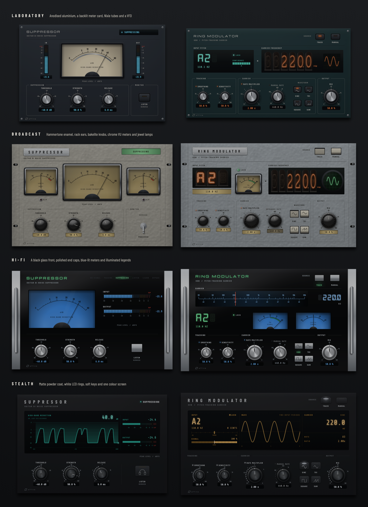

# Affine design language

**Version 2.0** · shared by every Affine plug-in · implemented by the `affine_ui` JUCE module in this folder

Affine plug-ins are **rendered instruments**. Each product is a believable piece of
hardware from the same bench: a real faceplate, knobs with calibrated scales, lit meters
and displays, all lit by one studio light. The hardware is a vehicle for clarity, not
decoration: every lamp, needle and digit reports real state.

The kit renders four **finishes**: Laboratory, Broadcast, Hi-Fi and Stealth. A finish
sets the materials, lamps and display technology. The principles, interaction contract,
states and telemetry rules below apply to every finish, and all products in a release
share one finish.

<p align="center">
  
</p>

## Principles

1. **One light.** A single softbox sits above and slightly left of the player. Every
   highlight, reflection and shadow in every product agrees with it, so the instruments
   read as physical objects and sit together on screen.
2. **Real materials, rendered.** Anodised aluminium, hammered enamel, powder coat and
   black glass; spun and polished aluminium, bakelite and rubber; meter cards, Nixie
   tubes, phosphor and LEDs. Materials are shaded procedurally at the display's physical
   resolution, never stretched bitmaps.
3. **Truth before spectacle.** An instrument only shows what the processor actually did.
   Stale readings go dark (lamps dim, needles rest, tubes extinguish, plots break);
   nothing is extrapolated or animated for effect. Needle ballistics and glows are
   presentation only and never feed back into processing.
4. **Printed like an instrument.** Labels are printed on the front, scales are calibrated
   through the parameter's own mapping (a log control gets a log scale), and controls are
   grouped by stage in signal-flow order, left to right.
5. **One hardware kit.** Products share knobs, keys, lamps, meters, displays and
   typography. Within a finish they differ only in colour and layout.
6. **Native behaviour is part of the design.** Every control has the same drag, fine,
   exact-entry, reset, keyboard and host-menu behaviour, and every edit is one host gesture.
7. **Accessible by construction.** Every control has a role, name, formatted value and
   keyboard path; critical state is never carried by colour alone; text meets 4.5:1.
8. **Cheap to keep on screen.** Static layers are cached per physical scale; only
   dynamic parts repaint, and only when their value changes. The audio thread publishes
   atomics and never waits for the UI.

## Anatomy of an instrument

```
┌──────────────────────────────────────────────────────────────────────┐
│ ◎                                                                  ◎ │
│   WORDMARK                                   primary mode / status   │  header band
│   DESCRIPTOR                                                         │
│ ──────────────────────────────────────────────────────────────────── │
│   instrument windows: meters, counters, displays (the hero)          │  what is happening
│                                                                      │
│  ╭─ STAGE ───────────╮ ╭─ STAGE ─────────────────╮ ╭─ OUTPUT ─╮     │  what you can change,
│  │  knobs · keys     │ │  knobs · keys           │ │  knobs   │     │  in signal-flow order
│  ╰───────────────────╯ ╰─────────────────────────╯ ╰──────────╯     │
│ ◎ ▱ affine                                                         ◎ │  maker's mark
└──────────────────────────────────────────────────────────────────────┘
```

- **Header band:** wordmark and descriptor on the left; the product's primary mode or
  status on the right.
- **Instrument windows:** the largest area shows what the plug-in is doing. Choose the
  display technology by the quantity and the finish (see below).
- **Controls:** grouped by stage, in signal-flow order, with printed frames or titled
  hairlines. Knob axes in a row share one horizontal line, as they would on a real panel.
- **Maker's mark** bottom left. How the front is held is part of the finish: corner
  screws (Laboratory), rack ears (Broadcast), end caps (Hi-Fi), nothing visible (Stealth).

## Finishes

| | Laboratory | Broadcast | Hi-Fi | Stealth |
|---|---|---|---|---|
| Front | Dark anodised aluminium, bead-blasted or brushed | Light hammertone enamel with rack ears and a riveted name plate | Black glass between polished aluminium end caps | Matte black powder coat |
| Knobs | Spun-aluminium cap on a knurled black grip | Glossy bakelite with a ribbed skirt and a white pointer | Spun cap on a polished aluminium body | Dark spun cap, white pointer, white LED ring |
| Keys | Anodised caps with LED windows | Piano keys; a chrome bat-handle toggle | Polished square buttons whose legends light | Rubber soft keys with LED strips |
| Lamps | LEDs behind domed lenses | Faceted jewels in chrome bezels | Legends lit from behind the glass | LEDs |
| Displays | Backlit meter card, LED ladders, Nixie tubes, VFD | Chrome-bezel VU meters, Nixie tubes, a phosphor scope | Blue-lit flush meters, a tuning dial, VFD, horizontal ladders | One colour screen: history plots, scopes, bars and numerals |
| Readouts | Glowing characters on glass | Dark ink in amber-lit windows | Glowing characters on glass | Glowing characters on glass |
| Printing | Light silkscreen, Michroma wordmark | Dark ink; the wordmark engraved on the name plate | Printed on the back of the glass and lit; green wordmark | Light silkscreen; wide-tracked condensed wordmark |

A finish is a `Theme`: `PanelFinish` (texture, base colour, grain, mottle, sheen, and
the hammertone dimple size), `KnobFinish` (cap and body materials and colours, cap and
grip proportions, dome, skirt ridges) and a `Palette` (printing, emission, lamp style,
readout style). Editors add the finish's fixing hardware and display choices.

### Product colours

| Finish | Suppressor | HDN Ring Modulator |
|---|---|---|
| Laboratory | Graphite `#2A3037`; glacier cyan `#4FD6FF`; incandescent meter card `#F2E4C4` | Petrol `#1F3538`; neon orange `#FF6A1C` Nixie carrier; VFD cyan `#5CF2D6` input |
| Broadcast | Warm grey `#B3B0A6`; signal green `#2F9E4F`; VU card `#F2D48A` | Blue grey `#A9B0B5`; neon orange `#FF6A1C` Nixies; phosphor `#7DFFA0` scope |
| Hi-Fi | Black glass `#050607`; meter light `#3A8EF0`; green legends `#54F28C` | The same glass and meter light; blue `#4AA8FF` dial pointer and readout; green VFD |
| Stealth | Powder coat `#17181B`; white LEDs `#EEF4FF`; teal screen `#35E0C8` | The same coat and LEDs; amber screen `#FFB23F` |

## Tokens

### Palette roles

Every finish defines the same roles; only the values change.

| Role | Use |
|---|---|
| Silkscreen | Labels, legends, frames, scale numbers |
| Silkscreen dim | Descriptors, secondary legends |
| Accent | The product's emission: lamps, displays, LED rings, focus |
| Attention | Amber `#FFB238` in every finish: engaged monitoring or learning states, hot segments |
| Danger | Red in every finish: clip cells only |
| Glass | Display and readout windows |
| Readout backlight and ink | Backlit readouts only (Broadcast) |

Printed text is at least 4.5:1 against the plate (checked against the plate's darker lower
edge too). Emitted colours are at least 4.5:1 against glass, and backlit readouts'
ink at least 4.5:1 against their window. All three are unit-tested per product.

### Typography

| Role | Face | Size |
|---|---|---|
| Wordmark | Michroma (Laboratory, Hi-Fi) or Barlow Condensed SemiBold tracked 0.36–0.45 (Broadcast, Stealth) | 21–30 px |
| Frame titles, control labels | Barlow Condensed SemiBold, tracked 0.16–0.26 | 11.5–12.5 px, capitals |
| Scale numbers | Barlow Condensed SemiBold | 9.5–10 px |
| Readouts and status | Share Tech Mono | 13.5–15 px; screen numerals up to 54 px |
| VFD characters | DSEG14 Classic Bold | 30–48 px |
| Nixie cathodes | Nixie One, fitted to the cathode stack | tube height |

All faces are bundled under the SIL Open Font License; see `fonts/licenses`.

### Geometry

| Token | Value |
|---|---|
| Knob sizes | large 84, medium 72, small 58 px (`metrics::knobLarge` …) |
| Knob sweep | 270°, 7 o'clock to 5 o'clock, up/right increases |
| Screws | 11 px, 14 px inset |
| Frames | 1.1 px rule, 7 px corners, title breaking the top rule |
| Display corners | 4 px |

## Choosing a display

| Quantity | Laboratory | Broadcast | Hi-Fi | Stealth |
|---|---|---|---|---|
| A magnitude that moves musically (gain reduction) | Backlit `NeedleMeter` with mirror scale | Chrome-bezel VU `NeedleMeter` | Flush blue `NeedleMeter` | Scrolling history plot on the screen |
| Peak level with clipping | Vertical `LadderMeter` | VU `NeedleMeter` with clip jewel | Horizontal `LadderMeter` | Segmented bars on the screen |
| A frequency or count | `NixieDisplay` | `NixieDisplay` | `TuningDial` with a readout | Screen numerals |
| A note name or short status | `DisplayLabel`, `GlowText` in DSEG14 | Alphanumeric `NixieDisplay`; backlit `DisplayLabel` | VFD `GlowText`; `IlluminatedLegends` | Screen numerals and captions |
| A set value | Glass readout under its knob | Backlit readout under its knob | Glass readout under its knob | Glass readout under its knob |
| On/off state | LED `render::indicator` | Jewel `render::indicator` | Lit legend | LED |

Screens are drawn by the product on `render::screenGlass`; they plot only stored readings
and leave gaps where there were none.

## Components

| Component | Contract |
|---|---|
| `Knob` | Rendered knob with a printed calibrated scale or an LED ring, a label and a readout. Drag anywhere (up/right increases), Shift for fine, double-click or Return for exact entry (Return commits, Escape cancels, malformed text never changes the value), Alt/Option-click or Home resets, arrows step, right-click opens the parameter menu with host items. Optional activity lamp for *inactive but editable* states. |
| `KeyButton` | Latching key in one of five styles (anodised cap, piano key, bat-handle toggle, polished square, soft key) with a printed legend and optional glyph; Space and Return operate it. |
| `SelectorKeys` | One key per choice of a choice parameter, in a row or grid; each press is one complete gesture; arrows move the selection. |
| `NeedleMeter` | Moulded, chrome or flush housing; lamp dims and needle rests when the reading is not live; spring-damper ballistics (VU-like by default); optional coloured zone and centre rest position. |
| `LadderMeter` | Vertical or horizontal; accent, attention and danger zones; smooth top segment; clip cell apart from the scale. |
| `NixieDisplay` | Numeral or alphanumeric tubes; right-aligned text, decimal cathode, ghost cathodes and honeycomb anode always visible; dark when the reading is absent. |
| `TuningDial` | A lit frequency dial with a gliding pointer that parks at the left stop without a reading. |
| `IlluminatedLegends` | A `juce::Label` shown as a row of printed legends of which the current one lights; the accessible text stays the label text. |
| `DisplayLabel` | A `juce::Label` shown as glowing characters on glass or dark ink on a lit window, with a status lamp; the accessible text stays the label text. |
| `Faceplate` | Caches the plate texture, edge, screws and everything printed on it per physical scale. |
| `render::*` | Faceplate textures, screws, recesses, lit windows, jewels, rack ears, name plates, end caps, screen glass, lamps, glow and halos. |
| `silkscreen::*` | Wordmark, groove, frame, legend, lit legend, maker's mark, screws. |
| `LookAndFeel` | Menus, tooltips and text entry in the family style. |

## States

| State | Presentation |
|---|---|
| Live | Lamps lit, needles move, digits glow, plots advance |
| No data or stale (no processed audio for 400–500 ms) | Lamps dim, needles rest at their stop, tubes and segments go dark, readouts show `--`, plots break |
| Inactive but editable (the control does not act in the current mode) | Activity lamp off, label, readout and LED ring dimmed; the control stays fully operable |
| Disabled | Knob veiled, scale or ring dark; not operable |
| Attention | Amber emission plus explicit text (e.g. `LISTENING TO DIFFERENCE`) |
| Clip | Red clip cell or jewel, held by the processor for one second, plus accessible text |
| Keyboard focus | Illuminated ring at the foot of the knob, outline around keys |

## Adding a product

1. Copy this folder unchanged into the plug-in as `libs/affine-ui`, `include()` its
   `AffineUI.cmake` after JUCE and link `affine_ui`.
2. Define the product's `affine::Theme` in the release's finish, with its own colours.
3. Lay out the header, instrument windows and control stages as above.
4. Publish telemetry from the processor through atomics with a freshness signal (a block
   counter or sequence) and present stale data as dark.
5. Add tests for contrast, control mapping and focus order, and a capture test that writes
   PNGs of every state for review.

## Keeping products in sync

This folder is identical in every Affine plug-in repository. Change it in one place, bump
the version in `affine_ui/affine_ui.h` and this document, and copy the folder to every
product in the same change set. `diff -r` between two checkouts must be empty.
