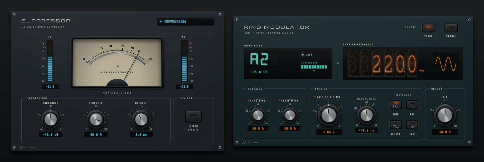

# Affine design language

**Version 1.0** · shared by every Affine plug-in · implemented by the `affine_ui` JUCE module in this folder

Affine plug-ins are **rendered laboratory instruments**. Each product is a believable piece of
precision hardware from the same bench: an anodised faceplate, machined knobs with calibrated
scales, backlit meters, glowing displays, all lit by one studio light. The hardware is a
vehicle for clarity, not decoration: every lamp, needle and digit reports real state.

<p align="center">
  
</p>

## Principles

1. **One light.** A single softbox sits above and slightly left of the player. Every
   highlight, reflection and shadow in every product agrees with it, so the instruments
   read as physical objects and sit together on screen.
2. **Real materials, rendered.** Anodised aluminium plate, spun-aluminium knob caps,
   knurled black grips, a backlit meter card, smoked display glass, neon and phosphor.
   Materials are shaded procedurally at the display's physical resolution, never
   stretched bitmaps.
3. **Truth before spectacle.** An instrument only shows what the processor actually did.
   Stale readings go dark (lamps dim, needles rest, tubes extinguish); nothing is
   extrapolated or animated for effect. Needle ballistics and glows are presentation only
   and never feed back into processing.
4. **Printed like an instrument.** Labels are silkscreened, scales are calibrated through
   the parameter's own mapping (a log control gets a log scale), and controls are grouped
   by printed frames that follow the signal flow from left to right.
5. **One hardware kit.** Products share knobs, keys, lamps, meters, displays, screws and
   typography. They differ in faceplate anodising, emission colour and layout.
6. **Native behaviour is part of the design.** Every control has the same drag, fine,
   exact-entry, reset, keyboard and host-menu behaviour, and every edit is one host gesture.
7. **Accessible by construction.** Every control has a role, name, formatted value and
   keyboard path; critical state is never carried by colour alone; text meets 4.5:1.
8. **Cheap to keep on screen.** Static layers are cached per physical scale; only
   dynamic parts repaint, and only when their value changes. The audio thread publishes
   atomics and never waits for the UI.

## Anatomy of an instrument

```
┌──────────────────────────────────────────────────────────────────────┐
│ ◎                                                                  ◎ │
│   WORDMARK                                   primary mode / status   │  header band
│   DESCRIPTOR                                                         │
│ ════════════════════════════════════════════════════════════════════ │  machined groove
│   instrument windows: meters, counters, displays (the hero)          │  what is happening
│                                                                      │
│  ╭─ STAGE ───────────╮ ╭─ STAGE ─────────────────╮ ╭─ OUTPUT ─╮     │  what you can change,
│  │  knobs · keys     │ │  knobs · keys           │ │  knobs   │     │  in signal-flow order
│  ╰───────────────────╯ ╰─────────────────────────╯ ╰──────────╯     │
│ ◎ ▱ affine                                                         ◎ │  maker's mark
└──────────────────────────────────────────────────────────────────────┘
```

- **Header band:** wordmark and descriptor on the left; the product's primary mode or
  status on the right; a machined groove underneath.
- **Instrument windows:** the largest area shows what the plug-in is doing. Choose the
  display technology by the quantity (see below).
- **Controls:** printed frames group controls by stage, in signal-flow order. Knob axes in
  a row share one horizontal line, as they would on a real panel.
- **Maker's mark** bottom left; four corner screws at a 14 px inset; 40 px outer margins.

## Tokens

### Shared palette

| Role | Value | Use |
|---|---|---|
| Silkscreen | `#ECE8DF` | Labels, legends, frames (at 30%), scale numbers |
| Silkscreen dim | `#AEAAA1` | Descriptors, secondary legends |
| Attention | `#FFB238` | Engaged monitoring or learning states, hot ladder segments |
| Danger | `#FF4A3D` | Clip cells only |
| Glass | `#07090B` | Display and readout windows |

Printed text is at least 4.5:1 against the plate (checked against the plate's darker lower
edge too) and emitted colours are at least 4.5:1 against glass; both are unit-tested.

### Product finishes

A product chooses an anodising, one emission accent, and optionally a second display
technology. Everything else is shared.

| Product | Anodising | Emission accent | Other emitters |
|---|---|---|---|
| Suppressor | Graphite `#2A3037` | Glacier cyan `#4FD6FF` | Incandescent meter card `#F2E4C4` |
| HDN Ring Modulator | Petrol `#1F3538` | Neon orange `#FF6A1C` (Nixie carrier) | VFD cyan `#5CF2D6` (input display) |

New products should pick an anodising that is distinct in hue but equally dark, and an
accent that stays at least 4.5:1 on glass.

### Typography

| Role | Face | Size |
|---|---|---|
| Wordmark | Michroma, tracked 0.18 | 21 px |
| Frame titles, control labels | Barlow Condensed SemiBold, tracked 0.16–0.24 | 11.5–12.5 px, capitals |
| Scale numbers | Barlow Condensed SemiBold | 9.5–10 px |
| Readouts and status | Share Tech Mono | 13.5–15 px |
| VFD characters | DSEG14 Classic Bold | 40–48 px |
| Nixie cathodes | Nixie One, fitted to the cathode stack | tube height |

All faces are bundled under the SIL Open Font License; see `fonts/licenses`.

### Geometry

| Token | Value |
|---|---|
| Knob sizes | large 84, medium 72, small 58 px (`metrics::knobLarge` …) |
| Knob sweep | 270°, 7 o'clock to 5 o'clock, up/right increases |
| Screws | 11 px, 14 px inset |
| Frames | 1.1 px rule, 7 px corners, title breaking the top rule |
| Display corners | 4 px |

## Choosing a display

| Quantity | Instrument | Component |
|---|---|---|
| A magnitude that moves musically (gain reduction) | Backlit moving-coil meter with mirror scale | `NeedleMeter` |
| Peak level with clipping | LED ladder with a separate clip cell | `LadderMeter` |
| A frequency or count | Nixie tube counter | `NixieDisplay` |
| A symbol (note name) or short status | Vacuum-fluorescent characters | `DisplayLabel`, `GlowText` with DSEG14 |
| A set value | Glass readout under its knob | built into `Knob` |
| On/off state | Jewel lamp | `render::lamp` |

## Components

| Component | Contract |
|---|---|
| `Knob` | Rendered knob with printed calibrated scale, label and glass readout. Drag anywhere (up/right increases), Shift for fine, double-click or Return for exact entry (Return commits, Escape cancels, malformed text never changes the value), Alt/Option-click or Home resets, arrows step, right-click opens the parameter menu with host items. Optional activity lamp for *inactive but editable* states. |
| `KeyButton` | Latching key with an LED window and printed legend; Space and Return operate it. |
| `SelectorKeys` | One lit key per choice of a choice parameter, in a row or grid; each press is one complete gesture; arrows move the selection. |
| `NeedleMeter` | Lamp dims and needle rests when the reading is not live; spring-damper ballistics settle in about 300 ms. |
| `LadderMeter` | Accent / attention / danger zones, smooth top segment, clip cell apart from the scale. |
| `NixieDisplay` | Right-aligned digits, decimal cathode, ghost cathodes and honeycomb anode always visible; dark when the reading is absent. |
| `DisplayLabel` | A `juce::Label` that renders as a glowing display with a status lamp; the accessible text stays the label text. |
| `Faceplate` | Caches the plate texture, edge, screws and everything silkscreened on it per physical scale. |
| `silkscreen::*` | Wordmark, groove, frame, legend, maker's mark, screws. |
| `LookAndFeel` | Menus, tooltips and text entry in the family style. |

## States

| State | Presentation |
|---|---|
| Live | Lamps lit, needles move, digits glow |
| No data or stale (no processed audio for 400–500 ms) | Lamps dim, needle rests at its stop, tubes and segments go dark, readouts show `--` |
| Inactive but editable (the control does not act in the current mode) | Activity lamp off, label and readout dimmed; the control stays fully operable |
| Disabled | Knob veiled, scale dimmed; not operable |
| Attention | Amber emission plus explicit text (e.g. `LISTENING TO DIFFERENCE`) |
| Clip | Red clip cell, held by the processor for one second, plus accessible text |
| Keyboard focus | Illuminated ring at the foot of the knob, outline around keys |

## Adding a product

1. Copy this folder unchanged into the plug-in as `libs/affine-ui`, `include()` its
   `AffineUI.cmake` after JUCE and link `affine_ui`.
2. Define the product's `affine::Theme`: anodising, accent, and any second emitter.
3. Lay out the header, instrument windows and framed control stages as above.
4. Publish telemetry from the processor through atomics with a freshness signal (a block
   counter or sequence) and present stale data as dark.
5. Add tests for contrast, control mapping and focus order, and a capture test that writes
   PNGs of every state for review.

## Keeping products in sync

This folder is identical in every Affine plug-in repository. Change it in one place, bump
the version in `affine_ui/affine_ui.h` and this document, and copy the folder to every
product in the same change set. `diff -r` between two checkouts must be empty.
